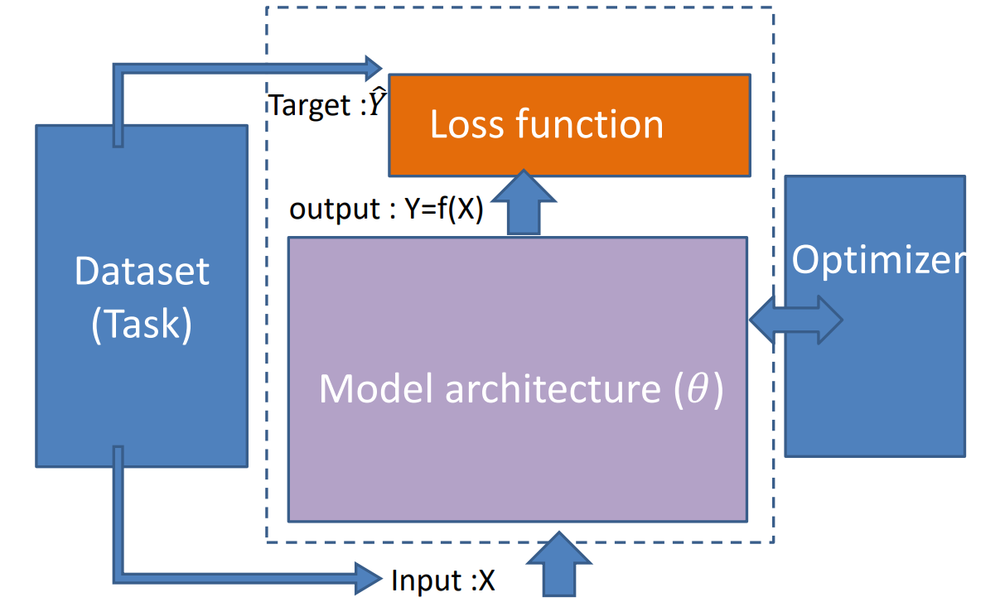
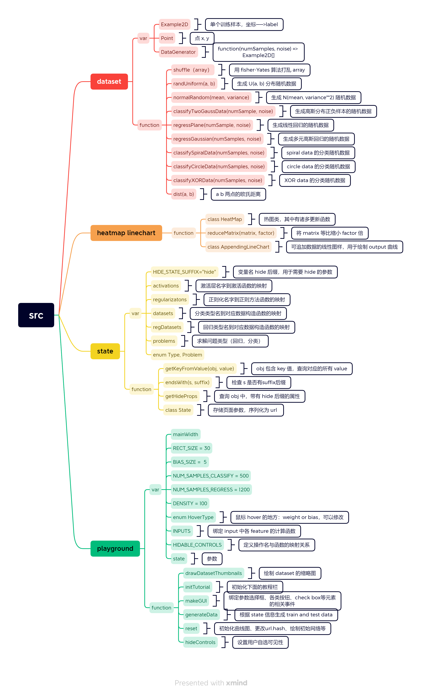
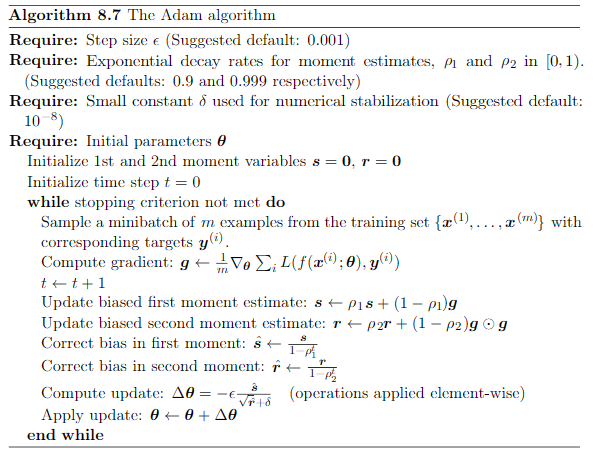

## 信息流






- ​	Dataset Part生成标签与数据传给**nn.ts**,
- ​    

## Adam 设计

> 伪代码：



```python
# Adam
class Adam:
    def __init__(self, lr=0.001, beta1=0.9, beta2=0.999):
        self.lr = lr
        self.beta1 = beta1
        self.beta2 = beta2
        self.iter = 0
        self.m = None
        self.v = None
        
    def update(self, params, grads):
        if self.m is None:
            self.m, self.v = {}, {}
            for key, val in params.items():
                self.m[key] = np.zeros_like(val)
                self.v[key] = np.zeros_like(val)
        
        self.iter += 1
        
        for key in params.keys():
            self.m[key] = self.beta1 * self.m[key] + (1 - self.beta1) * grads[key]
            self.v[key] = self.beta2 * self.v[key] + (1 - self.beta2) * (grads[key]**2)
            m_unbias = self.m[key] / (1 - self.beta1**self.iter)
            v_unbias = self.v[key] / (1 - self.beta2**self.iter)
            params[key] -= self.lr * m_unbias / (np.sqrt(v_unbias) + 1e-7)
```

```python
class Adam(OptimizerBase):
    
    def __init__(
        self,
        lr=0.001,
        decay1=0.9,
        decay2=0.999,
        eps=1e-7,
        **kwargs
    ):
        """
        参数说明：
        lr： 学习率，float (default: 0.01)
        eps：delta 项，防止分母为0
        decay1：历史梯度的指数衰减速率，可以理解为考虑梯度均值 (default: 0.9)
        decay2：历史梯度平方的指数衰减速率，可以理解为考虑梯度方差 (default: 0.999)
        """
        super().__init__()
        self.lr = lr
        self.decay1 = decay1
        self.decay2 = decay2
        self.eps = eps
        self.cache = {}

    def __str__(self):
        return "Adam(lr={}, decay1={}, decay2={}, eps={})".format(
            self.lr, self.decay1, self.decay2, self.eps
        )

    def update(self, param, param_grad, param_name, cur_loss=None):
        C = self.cache
        d1, d2 = self.hyperparams["decay1"], self.hyperparams["decay2"]
        lr, eps= self.hyperparams["lr"], self.hyperparams["eps"]

        if param_name not in C:
            C[param_name] = {
                "t": 0,
                "mean": np.zeros_like(param_grad),
                "var": np.zeros_like(param_grad),
            }

        t = C[param_name]["t"] + 1
        mean = C[param_name]["mean"]
        var = C[param_name]["var"]

        C[param_name]["t"] = t
        C[param_name]["mean"] = d1 * mean + (1 - d1) * param_grad
        C[param_name]["var"] = d2 * var + (1 - d2) * param_grad ** 2
        self.cache = C

        m_hat = C[param_name]["mean"] / (1 - d1 ** t)
        v_hat = C[param_name]["var"] / (1 - d2 ** t)
        update = lr * m_hat / (np.sqrt(v_hat) + eps)
        return param - update

    @property
    def hyperparams(self):
        return {
            "op": "Adam",
            "lr": self.lr,
            "eps": self.eps,
            "decay1": self.decay1,
            "decay2": self.decay2
        }    
    
 
```


## Normalization

有以下几种常见，可以在实现中添加：

Batch Renormalization https://arxiv.org/abs/1702.03275

 Layer Normalization https://arxiv.org/abs/1607.06450 

Instance Normalization https://arxiv.org/abs/1607.08022 

Group Normalization https://arxiv.org/abs/1803.08494 

Weight Normalization https://arxiv.org/abs/1602.07868 

Spectrum Normalization https://arxiv.org/abs/1705.10941

因为要求是至少完成Batch 与 Layer ,先给出以下：

### Batch Normalization

per channel across mini batch


### Layer Normalization

per sample per layer


初始化可以改，层数能加？
